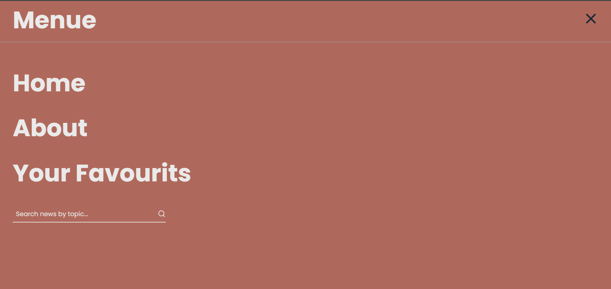

# 📰 News24

A modern news website built using **React.js** and **Tailwind CSS**, powered by the **GNews API**.  
News24 lets users explore the latest headlines, search for articles, and browse through categories — all with a clean and responsive UI.

---

## 🚀 Live Demo
🔗 **Live Link:** [Click here to visit News24](https://news-fix.vercel.app/)  


---

## 📸 Screenshots

| Home Page | Menu |
|------------|-------|
|  |  |


| News Details Page | Favourites Page |
|--------------------|-----------------|
|  |  |


---

## 🛠️ Tech Stack

- **Frontend:** React.js  
- **Styling:** Tailwind CSS  
- **API:** GNews API  
- **Package Manager:** npm  

---

## ⚙️ Setup Instructions

Follow these steps to run **News24** locally on your machine 👇

### Clone the repository
```bash
git clone https://github.com/your-username/news24.git
cd news24
npm install
Inside your project root directory, create a new file named .env
VITE_API_KEY=your_api_key_here!